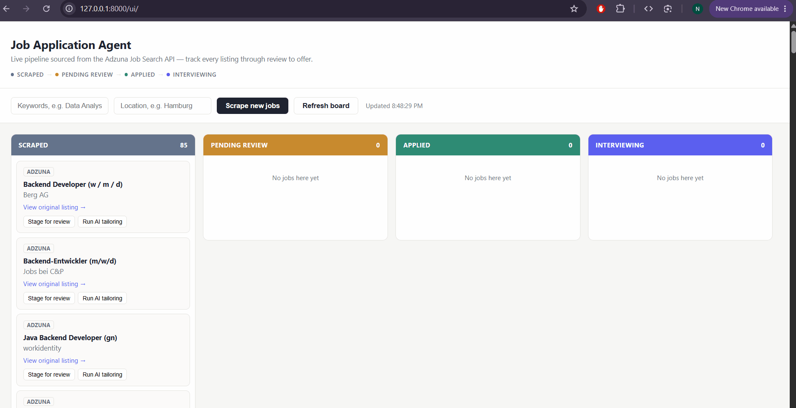

# 🤖 AI-Driven Job Application & Tracking Agent

A robust FastAPI backend service that pulls real-time job listings from the **Adzuna Job Search API**, processes them via a rule-based skill-overlap analysis engine, and tracks individual application states through a structured pipeline. Featuring a lightweight, responsive vanilla JS Kanban board frontend.

<p align="center">
  
</p>

---

## ✨ Key Features

* **Automated Ingestion** — Fetch live job data using keyword and location targets via an asynchronous HTTP client, filtering out pre-existing duplicates automatically.
* **Granular Review Pipeline** — Stage raw scraped listings in a `PENDING_REVIEW` phase to separate interesting leads from background noise.
* **Skill Tailoring Engine** — Evaluate job descriptions against specified resume target keywords to map skills and extract strategic talking points.
* **State Machine Tracking** — Step applications seamlessly across states:  
  `SCRAPED` ➔ `PENDING_REVIEW` ➔ `APPLIED` ➔ `INTERVIEWING` ➔ `OFFERED` / `REJECTED`

---

## 🏗️ Architecture

```text
       ┌────────────────────────────────────────────────────────┐
       │               Adzuna Job Search API                    │
       └───────────────────────────┬────────────────────────────┘
                                   │
                                   │ (httpx async client)
                                   ▼
       ┌────────────────────────────────────────────────────────┐
       │                   FastAPI Backend                      │
       │                                                        │
       │   Router Layer      [main.py]                          │
       │        ▼                                               │
       │   Service Layer     [services.py]  🠔 Scraper & Engine  │
       │        ▼                                               │
       │   Repository Layer  [crud.py]                          │
       └───────────────────────────┬────────────────────────────┘
                                   │
                                   ▼
       ┌────────────────────────────────────────────────────────┐
       │            SQLite Database (jobs_agent.db)             │
       │           & Static UI Served at /ui/                   │
       └────────────────────────────────────────────────────────┘


 

 **Layer breakdown**

| File | Responsibility |
|---|---|
| `app/models.py` | SQLAlchemy 2.0 async models, `JobStatus` enum, engine setup |
| `app/schemas.py` | Pydantic v2 request / response validation |
| `app/crud.py` | Repository layer — all database access lives here |
| `app/services.py` | Adzuna API client, deduplication logic, tailoring engine |
| `app/main.py` | FastAPI routes, lifespan startup, global 404 handler |
| `static/index.html` | Kanban board — vanilla JS, no build step |

---

## API Endpoints

| Method | Path | Body | Description |
|---|---|---|---|
| `POST` | `/api/jobs/scrape` | `{keywords, location}` | Queues a real Adzuna search (202 Accepted) |
| `GET` | `/api/jobs` | — | All jobs, newest first — feeds the Kanban board |
| `GET` | `/api/jobs/pending` | — | Jobs in `PENDING_REVIEW` only |
| `PUT` | `/api/jobs/{id}/apply` | — | Transitions a job to `APPLIED`, stamps `applied_date` |
| `PUT` | `/api/jobs/{id}/status` | `{new_status}` | Manual status update |
| `PUT` | `/api/jobs/{id}/tailor` | — | Runs the tailoring engine, saves the notes |
| `GET` | `/api/jobs/metrics` | — | Counts grouped by status |

Interactive API docs are available at `/docs` (Swagger UI) and `/redoc`.

---

## Running locally

```bash
git clone https://github.com/nestorNiloy/job-application-agent.git
cd job-application-agent

pip install -r requirements.txt

cp .env.example .env          # add your Adzuna credentials
uvicorn app.main:app --reload
```

Open `http://127.0.0.1:8000/ui/` for the Kanban board, or `/docs` for the full
interactive API documentation.

**Environment variables**

| Variable | Description |
|---|---|
| `ADZUNA_APP_ID` | Adzuna application ID |
| `ADZUNA_APP_KEY` | Adzuna application key |
| `ADZUNA_COUNTRY` | Two-letter country code (default: `de`) |

Register for free credentials at [developer.adzuna.com](https://developer.adzuna.com).

---

## Tech stack

Python 3.11 · FastAPI · SQLAlchemy 2.0 (async) · SQLite · aiosqlite · Pydantic v2 · httpx · Uvicorn
